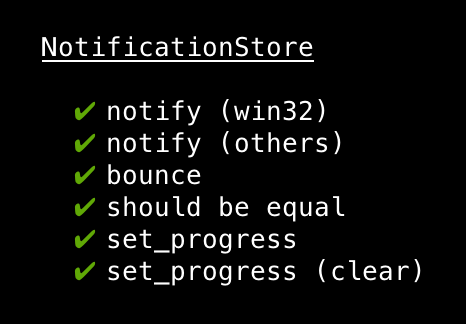

The goal of this page is to understand why existing code has been written
this way, and how to write new code that fits in with the old one.

## Tree structure

Electron apps have two sides: what happens in the `browser (node.js)` process,
and what happens in the `renderer (chromium)` process.

In itch, things that happen on the browser/node side are:

  * itch.io API requests
  * Installing dependencies (unarchiver, for example)
  * Driving downloads with butler
  * Launching applications
  * Showing native notifications, interacting with the OS shell, etc.

Things that happen on the renderer/chromium-content side:

  * Rendering the whole user interface
  * Showing HTML5 notifications

These used to be separated in the source tree, but they no longer are,
because it's useful to share code between them sometimes (with two copies,
one on each side).

Since the redux rewrite, there's only a single store per process:
the browser store is the reference one, and it sends diffs to all renderer
processes so that they're all kept in sync, using [redux-electron-store][].

[redux-electron-store]: https://github.com/samiskin/redux-electron-store

## Building

Sources are in `appsrc` and `testsrc`, compiled javascript files are
in `app`, and `test`.

Grunt drives the build process:

  * the `copy` task copies some files as-is (example: `testsrc/runner`)
  * the `sass` task compiles SCSS into CSS
  * the `ts` task compiles TypeScript into ES6 that Chrome & node.js understand

There's `newer` variants of some tasks (`newer:sass`) which
only recompile required files — those are the default grunt task.

The recommended workflow is simply to edit files in `appsrc` and `testsrc`,
and start the app with `npm start`. It calls the necessary grunt tasks, and
starts electron for you.

## TypeScript usage and features

We try to use recent versions of TypeScript, to take advante of new features.

### Async/await

We use TypeScript's async/await support to be able to write code that translates to coroutines:

Conceptually, it lets us write this:

```typescript
function installSoftware (name: string) {
  return download(name)
    .then(() => extract(name))
    .then(() => verify(name))
    .catch((err) => {
      // Uh oh, something happened
    });
}
```

...but like this:

```typescript
async function installSoftware (name: string) {
  try {
    await download(name);
    await extract(name);
    await verify(name);
  } catch (err) {
    // Uh oh, something happened
  }
}
```

## Code style

We abide by a pretty standard TSLint (by ) rules file, except:

  * `object-literal-sort-keys` is disabled because OCD doesn't make software better
  * `no-require-imports` is disabled because some node modules don't play well without it
  (might be solved by better typings / use of TypeScript namespaces)

Every CI build checks the code for conformance.

You can also run it manually on your machine with `npm run lint`.

Additionally, some editors have plug-ins to support real-time linting:

  * Visual Studio Code has a `TSLint` extension that does the job just fine.

### Casing

`camelCase` is used throughout the project, even though the itch.io
backend uses `snake_case` internally. As a result, for example,
API responses are normalized to camelCase.

Notable exceptions include:

  * SCSS variables, classes and partials are `kebab-case`
  * Source files are `kebab-case`
    * e.g. the `GridItem` content would live in `grid-item.js`
  * i18n keys are `snake_case` for historical reasons

## Testing

`npm test` is a bit sluggish, because it uses [nyc][] to register code
coverage. It also runs a full linting of the source code.

[nyc]: https://www.npmjs.com/package/nyc

The test harness we use is a spruced-up version of [substack/tape][], named
[zopf][]. It's basically the same except you can define cases, like so:

[substack/tape]: https://github.com/substack/tape
[zopf]: https://github.com/itchio/zopf

```javascript
import test from "zopf";

test("light tests", t => {
  t.case("in the dark", t => {
    // ... test things
  })
  t.case("in broad daylight", t => {
    // ... test things
  })
  t.case("whilst holding your hand", t => {
    // ... test things
  })
})
```

Cases run in-order and produce pretty output via [tap-spec][], like this:

[tap-spec]: https://github.com/scottcorgan/tap-spec



Also, test cases can be asynchronous:

```javascript
import test from "zopf"

test("filesystem stuff", t => {
  t.case("can touch and unlink", async t => {
    const file = "tmp/some_file";
    await myfs.touch(file);
    t.ok(await myfs.exists(file), "exists after being touched");
    await myfs.unlink(file);
    t.notOk(await myfs.exists(file), "no longer exists after unlink");
  })
})
```

### import, export, modules, require

Since we now use TypeScript's `import` and `export` support, faking modules has become
a bit trickier. Basically, the canonical way to get the default export of a module
is now this:

```javascript
// preferred way
import mymodule from "./my-module";

// sometimes required when the module needs to be required at a precise
// point in time because of side-effects
const mymodule = require("./my-module").default;
```

Two other tools we use heavily in tests are [proxyquire][], to provide fake
versions of modules, and `sinon`, to create spies/stubs/mocks. They're both
pretty solid libraries, and together with tape

[proxyquire]: https://github.com/thlorenz/proxyquire
[sinon]: https://github.com/sinonjs/sinon

## React components

Follow redux conventions, look at `appsrc/components/icon.tsx` for a good example.

We have our own `connect` which provides `props.t` for i18n, and we
usually export the un-connected class too, for testing.

## CSS

Our CSS is a bit of a wasteland for now, it could use a good cleanup and
better documentation.
