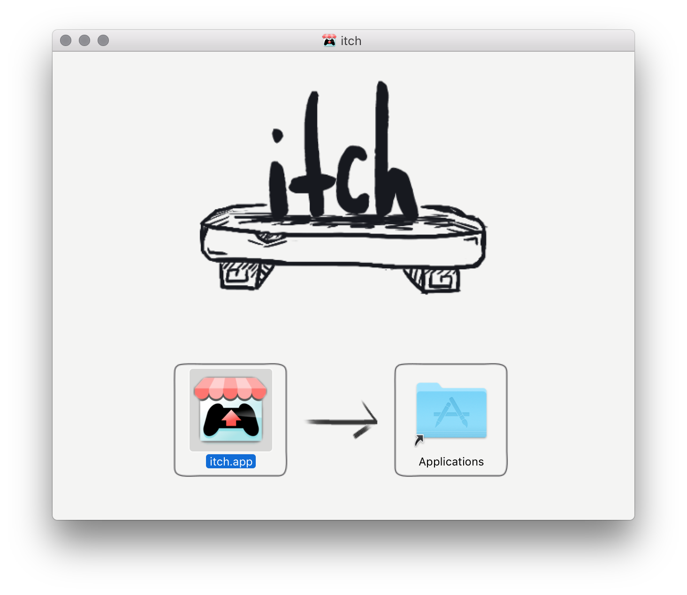

# Installing itch on OSX

  * Download the latest version from <https://itch.io/app>
  * Open the DMG image, a window pops up:



  * Drag the app to the `Applications` folder
  * Close & eject the DMG image
  * Launch the app by searching 'itch' in Spotlight

### Verifying the app

Recent versions of Mac OS X have built-in code signature verification mechanisms
enabled by default that will prevent opening unsigned apps (also known as
[Gatekeeper][]).

[Gatekeeper]: https://support.apple.com/en-us/HT202491

While this provides little *security* (any one can buy a $99/year individual developer
certificate), it does allow you to verify that the app you just downloaded was,
indeed, built and distributed by us (itch.io).

All our OSX binaries are signed by a Developer ID certificate to the name of [Amos Wenger][],
and you can verify them by running the following command in a terminal:

```bash
spctl -a -vvvv /Applications/itch.app
```

...where `/Applications/itch.app` is the full path to the .app. If the app is correctly
signed, you should see the following terminal output:

```
/Applications/itch.app: accepted
source=Developer ID
origin=Developer ID Application: Amos Wenger (B2N6FSRTPV)
```

[Amos Wenger]: https://github.com/fasterthanlime

## Updating

The app is self-updating on OSX, just like on Windows. Refer to the [Windows](./windows.md#updating) page for details.

## Uninstalling

You can uninstall the app by dragging `itch.app` out of your `/Applications`
folder and into the Trash.

Note that this won't remove your library, which resides at `~/Library/Application Support/itch`,
along with any additional install locations you have added from the app.
