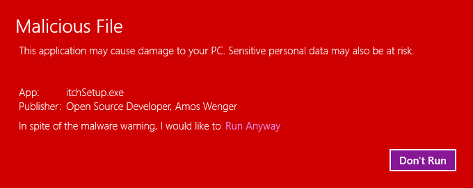
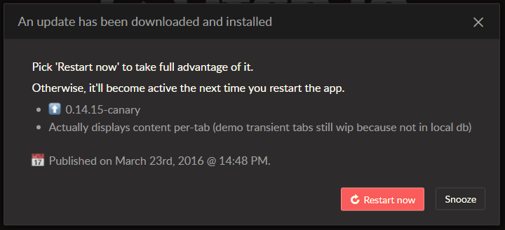
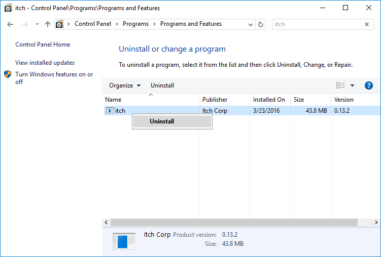
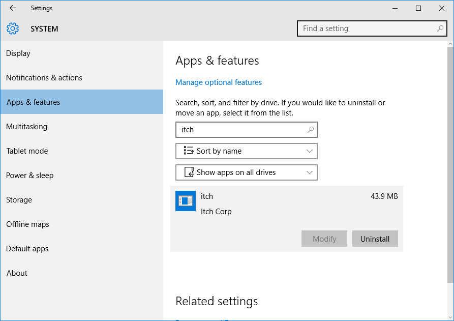

# Installing itch on Windows

  * Download the latest version from <https://itch.io/app>
  * Double-click the installer executable
    * You should see a splash screen for a few seconds
  * The app starts up, desktop & start menu shortcuts are created

If you encounter any problems installing the app, try to find out if
this page covers it, and if not, get in touch with [itch.io support](https://itch.io/support).

### Verifying the installer

All our installers, along with the application itself, are digitally signed
with an Open Source Developer certificate to the name of [Amos Wenger][].

[Amos Wenger]: https://github.com/fasterthanlime

*Open this dialog by right-clicking the installer, and choosing 'Properties'.*

It's a good habit to verify the signatures of executables you download — if
you encounter an installer that pretends to be the itch app, but doesn't have
our digital signature on it, you should not use it as it may be malware.

(Even the [canary version](./canary.md) is digitally signed with the same certificate.)

### Windows Defender / security warnings

Some people have reported issues installing the app on Windows 10, seeing
dialogs similar to this one:

The symptoms seem to change from machine to machine and from version to version,
there doesn't seem to be a definitive answer to it yet, but any new information
is welcome in the [discussion thread dedicated to it][issue-214].

[issue-214]: https://github.com/itchio/itch/issues/214

Additionally, we have contacted Microsoft support about this and are waiting to
hear back from them.

## Updating

The app's behavior when it comes to updating (itself) is:

  * Checking for updates every 6 hours
    * Or when manually asked to via the `Help -> Check for Updates` menu
  * When it finds an update, will download and apply it
  * At which point it'll prompt you to either:
    * Restart the app to take advantage of the new version right now, or
    * Snooze the update, and wait for the next time you restart the app yourself

## Uninstalling

itch can be uninstalled from the 'Add or Remove Software' section of the Windows
control panel:

On Windows 10, you can also find and uninstall it from the 'Apps & Features' section
of the Windows 10 settings interface:

