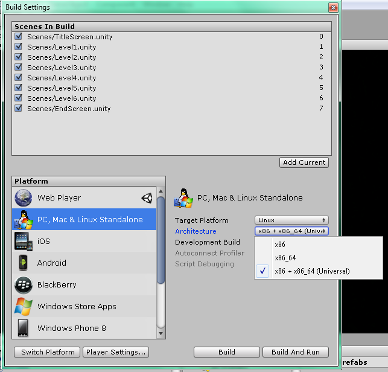

# Distributing Linux builds

The Linux ecosystem is composed of many different distributions, and each
have their own package format. For independent developers with limited
resources, it's often not practical to distribute and maintain repositories
with packages for each of these distributions.

Thankfully, distributing self-contained Linux builds is possible, and this
page tries to explain how.

## Common game engines (Unity, etc.)

Game engines like Unity take care of bundling any required libraries directly in
their export - some of them will give you a folder that you can just compress and
upload to itch.io, the app will install and run them, no questions asked.

[Unity]: https://unity3d.com/

For Unity in particular, you can use the 'Universal' export option that is similar
to the manual method described below:



[@atmospherium]: http://twitter.com/atmospherium
[ldue]: http://ludumdare.com/compo/2013/12/28/unity-export-for-linux-addendum-64-bit/

## Contracting out

If you aren't familiar with Linux at all, the most effective use of your resources
might be to let someone else handle it. There is a lot of knowledge involved, and
if you're not the tinkering type, a lot of frustration in store.

Some people port games to Linux for a living — finding them online shouldn't be
too hard. If you have a Publisher, they might be able to connect you to someone.
If they can't, get a better publisher.

## Homemade / low-level engine (Advanced)

If you're compiling binaries yourselves, either using a lower-level game engine,
or coding your own, then you need to bundle the required libraries yourself.

This section describes one possible way to go about it - the details are up to you.

### 1. Distribute a simple archive

.deb and .rpm are both complicated package formats with a large set of rules,
maintaining such packages is a full-time job, and there is no official way to
install them without administrator privilege.

Instead, simply pack your assets, executables and libraries in a simple archive,
which itch will be able to unpack, and keep up-to-date in a user-owned folder
without ever asking for their password.

*Note: some archivers will not maintain file permissions in .zip archives.
For that reason, you may want to use .tar.gz or .tar.bz2 instead. All three
are supported by the itch app.*

### 2. Ship both 32-bit and 64-bit binaries

At the time of this writing, 32-bit processors are becoming rarer, but 32-bit
operating systems are still a reality. Distributing both 32-bit and 64-bit
binaries is a small effort that prevents a lot of headaches.

*Unlike Windows, 64-bit installations of Linux might not be able to run 32-bit
applications, at least not out-of-the-box.*

Here's one way to do it: structure your game with separate folders, like so:

```
* foobar-v1.0.0/
  * foobar
  * assets/
  * x86/
    * foobar.x86
    * libbaz.so.2.1.3
  * x86_64/
    * foobar.x86_64
    * libbaz.so.2.1.3
```

*In the above, names ending with a `/` are folders, whereas other names are files*

The `assets` folder contains music, sound effects, textures, level data,
whereas the `x86` and `x86_64` folders contains an executable along with
the dynamic libraries it requires.

The `foobar` file is a launcher script following this structure:

```bash
#!/bin/bash

# Move to script's directory
cd "`dirname "$0"`"

# Get the kernel/architecture information
ARCH=`uname -m`

# Set the libpath and pick the proper binary
if [ "$ARCH" == "x86_64" ]; then
	export LD_LIBRARY_PATH=$LD_LIBRARY_PATH:./x86_64/
	./x86_64/foobar.x86_64 $@
else
	export LD_LIBRARY_PATH=$LD_LIBRARY_PATH:./x86/
	./x86/foobar.x86 $@
fi
```

*This script is a simplified version of the [GameName.sh][gamename]
by Ethan "flibitijibibo" Lee*

[gamename]: https://gist.github.com/flibitijibibo/5365145

### Finding which libraries you need to include

The `ldd` tool prints a list of libraries an executable depends on. Here's its
output on the 64-bit executable of an [example SDL2-based game][btf]:

[btf]: https://fasterthanlime.itch.io/behind-the-fence

```
$ ldd bins/plant64
	linux-vdso.so.1 =>  (0x00007ffd7c771000)
	libSDL2-2.0.so.0 => not found
	libpthread.so.0 => /lib/x86_64-linux-gnu/libpthread.so.0 (0x00007f24f38ff000)
	libm.so.6 => /lib/x86_64-linux-gnu/libm.so.6 (0x00007f24f35f6000)
	libfreetype.so.6 => /usr/lib/x86_64-linux-gnu/libfreetype.so.6 (0x00007f24f3350000)
	libdl.so.2 => /lib/x86_64-linux-gnu/libdl.so.2 (0x00007f24f314c000)
	libGLEW.so => not found
... (cut for readability)
```

The output is sizable, we can cut it down by piping ldd's output into `grep`:

```
$ ldd bins/plant64 | grep 'not found'
	libSDL2-2.0.so.0 => not found
	libGLEW.so => not found
```

In this example, the Linux installation on which this command was run is missing
SDL2 and GLEW. Adding those in `lib64` folder, we can check that we didn't miss
any by setting `LD_LIBRARY_PATH` while running ldd:

```
$ LD_LIBRARY_PATH='lib64' ldd bins/plant64 | grep 'not found'
```

The lack of output is a good sign! All libraries have been found. Indeed,
running the game with the right library path works:

```
$ LD_LIBRARY_PATH='lib64' bins/plant64
... (normal game output)
```

Whereas running it *without* the bundled libraries crashes immediately:

```
$ bins/plant64
bins/plant64: error while loading shared libraries: libSDL2-2.0.so.0: cannot open shared object file: No such file or directory
```

**Important note:** `glibc` and `libstdc++` are libraries you usually do *not*
want to bundle. Just make sure your application doesn't depend on a version of
them that is too recent (as explained below).

The same advice applies to most `libGL*.so` libraries — don't bundle your own
graphic card's drivers!

### Building on older systems for maximum compatibility

As a developer, you might be running the latest and greatest version of your
Linux distribution - but your players might not. Binaries compiled on recent
version of [Ubuntu][], for example, might fail on older [Fedora][] versions.

[Ubuntu]: http://www.ubuntu.com/
[Fedora]: https://getfedora.org/

Part of the reason is the GLIBC version your executable is linked against.
While bundling the dynamic libraries you use is relatively easy, linking
against a different GLIBC version is a whole nother matter.

You can use this helpful homegrown script, [glibc-check.sh][], to print the
GLIBC versions required by a binary or a dynamic library. Here's its output
when run against the example game mentioned above:

```
$ ./glibc-check.sh behindthefence/bins/plant64
Found version 2.2.5
Found version 2.3
Found version 2.3.2
Found version 2.3.3
```

[glibc-check.sh]: https://gist.github.com/fasterthanlime/17e002a8f5e0f189861c

By making sure that the GLIBC version your executable depends on is old enough,
you'll ensure maximum compatibility with your players' sofware. Since it's
hard to link against an older GLIBC version, there's a few different ways to produce
your distribution builds (that don't involve rebooting)

#### Using virtual machines (VM)

You can use a virtual machine provider like [VMWare Player][], and have two Linux
images, one 32-bit (386), and one 64-bit (amd64), so that you can produce both
versions of your executables and all required libraries.

[VMWare Player]: https://www.vmware.com/products/player

Take an old Debian (7.x for example), build your dependencies yourself in a
prefix, and you'll be sure your game can run almost anywhere. You can refer to
the [Building Linux software into a
prefix](../../appendix/building-into-a-prefix.md ) appendix to learn more about how
and why do it.

#### Building in chroots

chroots are (in layman's terms) a way to run a Linux distribution within a
Linux distribution. Although they are harder to setup than just grabbing a VM
image, they are also much lighter, since you don't need to emulate a whole x86
computer and dedicate a whole portion of your RAM to it.

If you want to set up both a 64-bit and a 32-bit chroot of an older debian,
for example, you'll need a 64-bit "host" (a recent Ubuntu, for example).

The [Debootstrap][] family of tools is particularly helpful for setting debian chroots.

[Debootstrap]: https://wiki.debian.org/Debootstrap

#### Setting up your own build servers

It's not uncommon for medium-sized software to have its own build servers. Thanks
to providers like [DigitalOcean][], it's not that costly either!

[DigitalOcean]: https://www.digitalocean.com/

VPS (Virtual Private Servers) are basically always-on virtual machines in the cloud,
that you can rent for about 5 dollars a month. If you release new versions of your
game often, it might be interesting for you to set up some sort of Continuous Deployment
infrastructure

See how [we deploy itch continuously](../../developing/continuous-deployment.md) for an example!

### 3. Get testers!

Even when following all the advice in this page to the letter, mistakes are
easy to make. The best way to make sure your game runs everywhere is to have
people everywhere run it.

itch.io and the itch app make it easy to give other people access to a
yet-unreleased game. Refer to the [Distributing pre-release builds with itch.io][distitch]
guide for an overview of your various options.

[distitch]: https://itch.io/t/13498/distributing-pre-release-builds-with-itchio

*Don't forget to mention testers in your software's credits. Testers can make
or break software.*

## Further reading

  * Ethan Lee wrote a guide on [how he packages Linux games using MojoSetup](https://gist.github.com/flibitijibibo/b67910842ab95bb3decdf89d1502de88)
  * His [Magfest 2016 slides](http://www.flibitijibibo.com/magfest2016/) covers a bunch of cross-platform development subjects out of the scope of this book.
  * The FNA wiki also has a [similar article](https://github.com/FNA-XNA/FNA/wiki/3:-Distributing-FNA-Games#gnulinux>)
  * The freegamedev Wiki has a [Portable binaries](http://freegamedev.net/wiki/Portable_binaries) page that goes in the same direction. It also covers the 'rpath' approach, not mentioned in this book.

The MojoSetup approach is friendly both for manual installations and is a supported
installation method in the itch app.

*Special thanks to Ethan Lee for proofreading this page and contributing advice.
See the Acknowledgements section of this book for a full list of contributors.*
