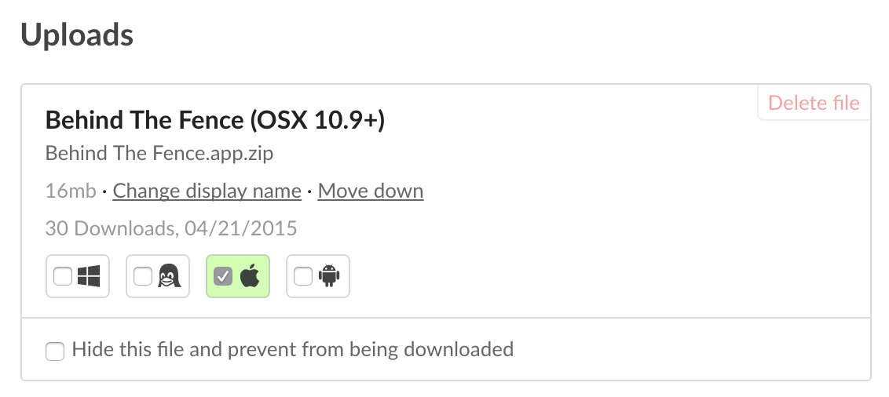

# Getting your game up and running

Here's a crash course on getting your game running within the itch app — chances are, it already works!

## Tag your uploads

The itch app tries to guess a lot of thing, but it relies on you to tell
it what to download for which platform. You can do so by checking the
appropriate checkbox in the 'Edit game' page.

*The icons represent, in order: Windows, Linux, Mac OSX, and Android*

You can distribute binaries for several platforms in a single archive,
if you want. The itch app will look for the right kind of binary to launch
on the appropriate platform.

## Keep it simple, or ship a manifest

The surest way to get your game working first try in the app is to
ship an [app manifest](./manifest.md). It will tell the app how to launch
your game, and will even let you specify secondary actions, and even integrate
into the itch.io API.

**When no manifest is found**, the app tries to mimic a human when launching a game.
The general rule is: the top-most executable wins. If you are also distributing
a level editor, etc., you really should ship an [app manifest](./manifest.md)
to let your players choose.

Additionally:

  * The app can tell the difference between Linux, Mac OS, and Windows
  executables — which allows you to distribute all three in a single archive.
  * The app will set the executable bit on every binary it can find before
  attempting to launch the game, salvaging badly-zipped archives.
  * The app actively avoids files containing strings resembling `uninstall`
  * The app will prefer shell scripts to binaries on Linux (allowing you to
    set up the `LD_LIBRARY_PATH` correctly, for example)

## Use simple archive formats

The ideal way is to let itch.io archive your game for you by directly
uploading a folder using the [butler](https://itch.io/docs/butler) command-line upload tool.

As an added bonus, uploading with [butler](https://itch.io/docs/butler) lets
your players update in a quick and easy way (the app will download small patches
instead of re-downloading the entire game).

The app will also happily install archives uploaded directly from the itch.io
web interface: .zip, .7z, .tar.gz, .tar.bz2, .dmg, even .rar.

Some installer formats are supported on Windows, but we [advise against using them](https://github.com/itchio/itch/issues/671),
if you can help it. In time, [app manifests](./manifest.md) will let you do
things like install prerequisites, which you would normally need an installer for.

**TL;DR: [butler](https://itch.io/docs/butler) > archives > installers > nothing**
(where `>` means 'is better than')

## Test your games

The itch app will let you install all your own projects, whether they
have a minimum price or not. If you need help testing your game, here are
places you can look for testers:

  * The [itch.io community forums](https://itch.io/community)
  * The [itch.io chat](https://itch.io/chat)

## A note about page types

The [itch.io](https://itch.io) website lets you pick between several
project types.

The app does platform filtering, configuration and launching
for the types `game` and `tool`. All other types, including `assets`, 
`game_mod`, `physical_game`, `soundtrack`, `comic`, `book`, and `other`
are just treated like a folder that it lets the user open.

If you're wondering why the app is giving you the choice to download
something that isn't tagged for your platform, that's why.
